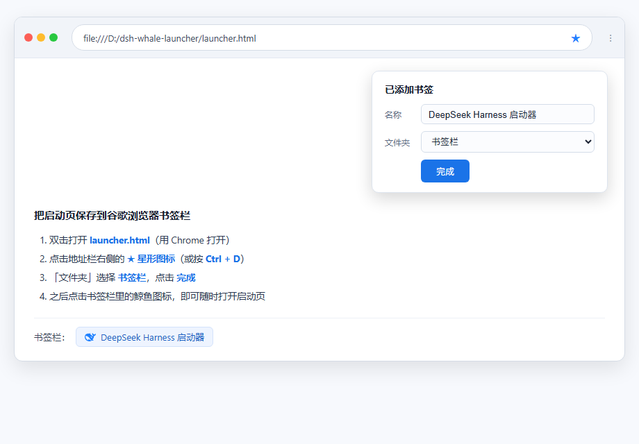

# Dsh Whale Launcher · DeepSeek Harness 鲸鱼启动器

一个带官方 DeepSeek 鲸鱼动画的桌面启动器：**点击鲸鱼 → 精致喷水动画 → 喷完自动启动 DeepSeek Harness → 自动进入**。

## 💡 背景

每次使用 DeepSeek Harness 都要打开终端、输入启动命令（例如 `node --import tsx/esm apps/cli/src/bin.ts web`）拉起 web 服务，再手动打开浏览器——太麻烦了。这个项目把整个流程变成一个动作：**点一下鲸鱼**。喷水动画结束后自动拉起服务，并带你直接进入 DeepSeek Harness 界面。安装一次，之后每天只需点两下。


## 📷 界面预览

<p align="center">
  
  
</p>

> 左：初始状态（黑色官方鲸鱼）· 右：点击后喷水动画（喷完自动启动并进入）

## ✨ 功能特性

- 使用 **DeepSeek 官方鲸鱼 logo** 矢量图形
- 点击鲸鱼播放精致喷水动画（水柱 + 水珠粒子 + 水雾，鲸鱼变蓝并轻微浮动）
- **喷水完成后才启动**，启动成功自动跳转进入
- 支持自定义本地 dsh 目录，**保存后默认记住**
- 服务已在运行时，打开页面直接进入

## 🚀 快速开始

### 第 1 步：获取本仓库

```sh
git clone https://github.com/xielixing/dsh-whale-launcher.git
```

或直接下载 ZIP 并解压。

### 第 2 步：一键安装（只需一次）

双击仓库根目录的 **`install.bat`**，看到 `registered successfully` 即可关闭窗口。它会把启动能力注册到浏览器（当前用户级，不需要管理员权限）。

### 第 3 步：打开启动页

双击 **`launcher.html`**（或用 Chrome / Edge 打开）。建议顺手把页面加入浏览器书签，见下文「🔖 保存到谷歌浏览器书签」。

### 第 4 步：点击鲸鱼

1. 首次使用：在页面下方输入框填写你的本地 dsh 目录（例如 `D:\deepseek-harness`），点击「保存」，之后自动记住；
2. 点击鲸鱼：播放约 2.4 秒喷水动画 → 喷完自动启动 dsh web（启动窗口最小化）→ 页面检测到服务就绪后自动跳转进入；
3. 服务已在运行时，打开页面会自动进入，无需点击。

> 停止服务：关闭任务栏中最小化的启动窗口即可。

## 🔖 保存到谷歌浏览器书签

<p align="center">
  
</p>

1. 双击打开 `launcher.html`（用 Chrome 打开）；
2. 点击地址栏右侧的 **★ 星形图标**（或按 **Ctrl + D**）；
3. 在弹窗中「文件夹」选择 **书签栏**，点击 **完成**；
4. 之后点击书签栏里的鲸鱼图标，即可随时打开启动页。

## 📁 目录结构

```text
├── launcher.html       启动页（鲸鱼动画 + 目录记忆 + 自动跳转）
├── install.bat         一次性安装脚本（注册 dsh-launch 协议）
├── uninstall.bat       卸载脚本
├── scripts/
│   └── dsh-launcher.ps1 协议处理器（校验目录、防重复启动、拉起 dsh web）
├── assets/             README 截图
├── LICENSE
└── README.md
```

## 📄 License

[MIT](LICENSE)
