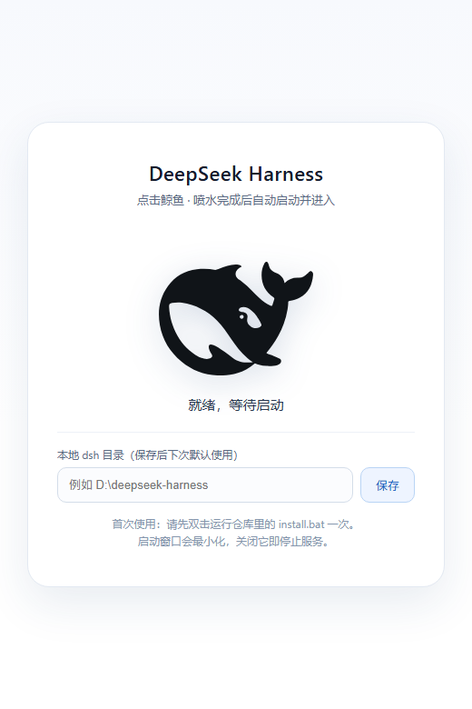
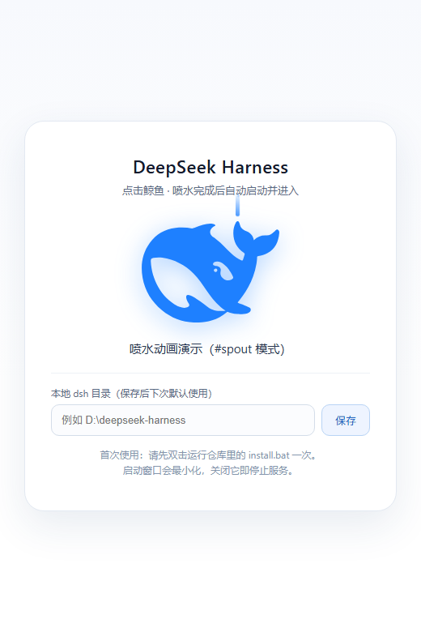

# Dsh Whale Launcher · DeepSeek Harness 鲸鱼启动器

一个带官方 DeepSeek 鲸鱼动画的桌面启动器：**点击鲸鱼 → 精致喷水动画 → 喷完自动启动 DeepSeek Harness → 自动进入**。

## 💡 背景

每次使用 DeepSeek Harness 都要打开终端、输入启动命令（例如 `node --import tsx/esm apps/cli/src/bin.ts web`）拉起 web 服务，再手动打开浏览器——太麻烦了。这个项目把整个流程变成一个动作：**点一下鲸鱼**。它会在喷水动画结束后自动拉起服务，并带你直接进入 DeepSeek Harness 界面。安装一次之后，每天只需要点一下书签、点一下鲸鱼。


## 📷 界面预览

<p align="center">
  
  
</p>

> 左：初始状态（黑色官方鲸鱼）· 右：点击后喷水动画（喷完自动启动并进入）

## ✨ 功能特性

- 使用 **DeepSeek 官方鲸鱼 logo** 矢量图形
- 点击鲸鱼播放精致喷水动画（水柱 + 水珠粒子 + 水雾，喷水时鲸鱼轻微浮动）
- **喷水完成后才启动** DeepSeek Harness，启动成功自动跳转进入
- 支持自定义本地 dsh 目录，**保存后默认记住**（浏览器本地存储）
- 服务已在运行时，打开页面直接进入，无需重复启动
- 一次安装永久生效，不需要管理员权限

## 🚀 快速开始

### 第 1 步：获取本仓库

```sh
git clone https://github.com/xielixing/dsh-whale-launcher.git
```

或直接下载 ZIP 并解压。

### 第 2 步：一键安装（只需一次）

双击运行仓库根目录的 **`install.bat`**：

- 它会注册本机的 `dsh-launch` URL 协议（写入当前用户注册表，**不需要管理员权限**）；
- 看到 `Protocol dsh-launch registered successfully.` 即可关闭窗口。

### 第 3 步：打开启动页

双击 **`launcher.html`**（或用 Chrome / Edge 打开）。

> 推荐：在浏览器里按 `Ctrl + D` 把它加入书签栏，以后点击书签即可打开。

### 第 4 步：点击鲸鱼

1. 首次使用：在页面下方输入框填写你的本地 dsh 目录（例如 `D:\deepseek-harness`），点击「保存」；
2. 点击鲸鱼：播放约 2.4 秒喷水动画 → 喷水完成后自动启动 dsh web（启动窗口最小化）→ 页面自动检测到服务就绪 → 跳转进入 DeepSeek Harness；
3. 如果服务**已经在运行**，打开页面会自动进入，无需点击。

## 🧭 使用细节

| 操作 | 说明 |
| --- | --- |
| 记住目录 | 点击「保存」后写入浏览器本地存储，下次打开自动带出 |
| 停止服务 | 关闭任务栏中最小化的 dsh 启动窗口即可 |
| 重复打开 | 服务已运行时，启动页会自动跳转进入 |
| 更换目录 | 直接在输入框修改并保存 |

## ❓ 常见问题

### 为什么必须运行一次 install.bat？

这是浏览器的安全底线：网页（包括本地 HTML）的 JavaScript 不允许启动电脑上的程序或写入注册表，否则任何网页都能在本机执行任意命令。启动器通过自定义 URL 协议（`dsh-launch://`）唤起本机的 PowerShell 脚本，而协议注册必须由浏览器之外的程序完成一次。所有带"链接唤起"能力的软件（Steam、Zoom 等）都是同样的机制。

### 首次点击鲸鱼，浏览器弹出了确认框

正常。点击**允许**，并勾选「始终允许」，以后就不再询问。

### 点击后一直喷水、提示启动超时

- 确认运行过 `install.bat`（重新运行一次即可）；
- 检查填写的目录是否正确（目录下应有 `package.json`）；
- 打开任务栏最小化的启动窗口查看 dsh web 的报错日志。

### 如何卸载

1. 双击运行 **`uninstall.bat`** 删除协议注册；
2. 删除本仓库文件夹。

### 3080 端口被其他程序占用

dsh web 会启动失败，查看最小化窗口中的报错。关闭占用端口的程序后重新点击鲸鱼。

## 🔧 工作原理

```text
launcher.html（点击鲸鱼）
    │  喷水动画结束后触发
    ▼
dsh-launch://start?dir=<目录>   ← URL 协议
    │
    ▼
scripts/dsh-launcher.ps1   ← 校验目录 → 后台启动 dsh web
    │
    ▼
launcher.html 轮询 http://127.0.0.1:3080/（no-cors 探测）
    │
    ▼
服务就绪 → 自动跳转进入 DeepSeek Harness
```

## 📁 目录结构

```text
├── launcher.html       启动页（鲸鱼动画 + 目录记忆 + 自动跳转）
├── install.bat         一次性安装脚本（注册 dsh-launch 协议）
├── uninstall.bat       卸载脚本（删除协议注册）
├── scripts/
│   └── dsh-launcher.ps1 协议处理器（校验目录、防重复启动、拉起 dsh web）
├── LICENSE
└── README.md
```

## 📄 License

[MIT](LICENSE)
